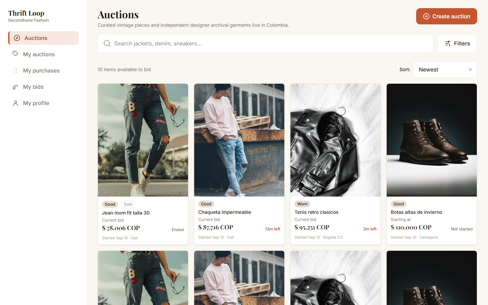
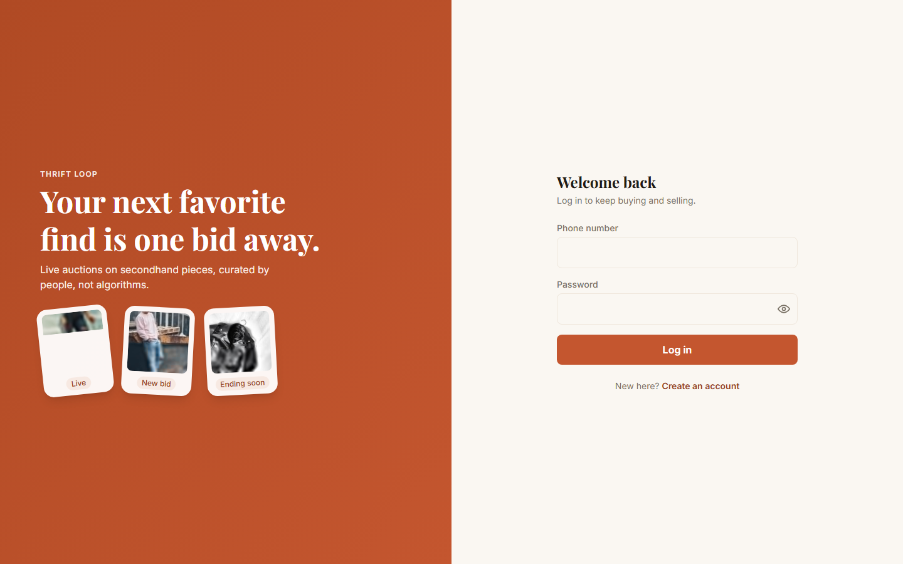
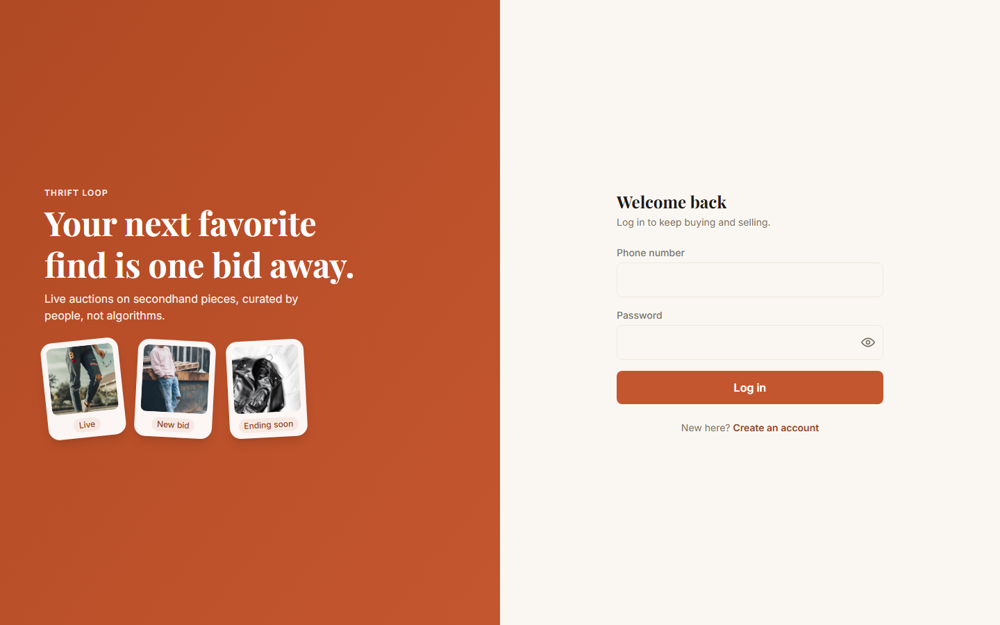

<div align="center">

# Thrift Loop

**Live auctions for second-hand clothing.**

Your next favorite find is one bid away. Curated pieces, real-time bidding, no algorithms
deciding what you see.

[](https://thrift-loop.onrender.com)


</div>

---

## Live demo

**[thrift-loop.onrender.com](https://thrift-loop.onrender.com)**

Hosted on Render's free tier: the instance sleeps after inactivity, so the first request can
take up to a minute to wake it up, and the app's JSON-file storage is **not persistent** —
data resets on every redeploy or restart. See [`docs/015-render-deploy`](docs/015-render-deploy)
for the deployment tradeoffs.

## Screenshots

| Auctions grid                          | Auction detail                                    |
| -------------------------------------- | ------------------------------------------------- |
|  |  |

| Sign in                         |
| ------------------------------- |
|  |

## Features

**Auctions & listings**

- Create, edit, and delete auction drafts — category, condition, price in COP, delivery method,
  up to 10 photos, a multi-photo carousel on the detail page
- Manual or scheduled auto-publish; a published auction's terms are immutable
- Manual early close by the seller, awarding the current top bidder, with a winner celebration
  overlay

**Bidding**

- Minimum bid increments, enforced server-side
- A rolling 30-minute anti-snipe window that resets on every new bid
- Serialized concurrent bids and a background scheduler that auto-closes auctions and awards
  the winner

**Search & discovery**

- Full-text search plus category, city, and price-range filters
- City defaults to the viewer's own profile city
- "My bids" page: one row per auction you've bid on, with your top bid and live status
  (Winning / Outbid / Won / Lost / Ended)

**Realtime**

- WebSocket-driven live price and status updates on the grid and detail pages
- Notifications for being outbid, winning an auction, or receiving a bid on your listing —
  each independently toggleable
- Live viewer count ("N people viewing") on the detail page

**Accounts & security**

- Phone + password accounts (Colombia), bcrypt password hashing, httpOnly session cookies
- Every client-side validation is mirrored server-side
- CSRF protection, rate limiting, and a stored-XSS fix on photo uploads (extension derived
  from the validated MIME type, never from client input)

**Observability**

- Structured JSONL logger with request-ID correlation across HTTP, the scheduler, and
  WebSocket connections, plus a local log-viewer page

## Tech stack

|              |                                                                                   |
| ------------ | --------------------------------------------------------------------------------- |
| **Frontend** | React 18, TypeScript, Vite, Tailwind CSS v4, Zustand, react-router 7              |
| **Backend**  | Node.js, Express 4, `ws` (WebSockets), JWT, bcrypt                                |
| **Storage**  | JSON-file repositories behind a swappable interface (`apps/api/src/repositories`) |
| **Testing**  | Vitest + Testing Library (unit/integration), Playwright (E2E)                     |
| **Tooling**  | ESLint (security, sonarjs, no-secrets plugins), Prettier, Husky, npm workspaces   |

## Architecture

```
apps/
  web/      React SPA — Atomic Design (atoms/molecules/organisms/pages),
            Zustand stores, only organisms/pages touch stores or the API
  api/      Express — routes → services → repositories, factory functions
            (no classes), asyncHandler + centralized HttpError handling
packages/
  shared/   Domain types shared between web and api
e2e/        Playwright suite, runs against the production build
docs/       One folder per feature (docs/NNN-feature-name), each with
            spec.md / plan.md / tasks.md
scripts/    One-off tooling (tsx), e.g. brand-asset generation
```

In production, `apps/api` serves the built `apps/web` SPA as static files (single origin, no
CORS) with an SPA fallback for client-side routes.

## Getting started

```bash
nvm use                          # Node 22
npm install
cp apps/api/.env.example apps/api/.env
# set JWT_SECRET in apps/api/.env

npm run build:shared
npm run dev --workspace=apps/api   # http://localhost:3000
npm run dev --workspace=apps/web   # http://localhost:5173 (proxies /api, /uploads)
```

Seed local data (creates accounts with a hardcoded, dev-only password — refuses to run when
`NODE_ENV=production`):

```bash
npm run seed --workspace=apps/api
```

## Scripts

| Command                                 | Does                                                   |
| --------------------------------------- | ------------------------------------------------------ |
| `npm run dev --workspace=apps/api\|web` | Local dev servers                                      |
| `npm run build`                         | Build every workspace                                  |
| `npm test` / `npm run test:cov`         | Unit tests / with coverage                             |
| `npm run e2e`                           | Playwright suite against a production build            |
| `npm run lint` / `npm run format`       | ESLint / Prettier                                      |
| `npm run typecheck`                     | TypeScript across all workspaces                       |
| `npm run verify`                        | Everything CI runs, locally                            |
| `npm run assets:generate`               | Regenerate favicons/OG image (Playwright, no new deps) |
| `npm run screenshots`                   | Recapture the screenshots above                        |

## Testing

Unit and integration tests run under Vitest, co-located with their source
(`x.ts` + `x.test.ts`, never a separate `tests/` tree). CI enforces **≥85% coverage** on
lines, functions, branches, and statements in every workspace. The Playwright suite in `e2e/`
runs full user flows — auth, browse/search, bidding, notifications, and two-browser-context
realtime — against a real production build.

## Engineering practices

This project follows **Spec-Driven Development**: no code lands without an approved
`docs/NNN-feature-name/{spec.md, plan.md, tasks.md}` first. And **Test-Driven Development**:
every change starts with a failing test. See [`AGENTS.md`](AGENTS.md) for the full working
agreement, and [`docs/`](docs) for the spec history — every feature in this README traces back
to one.

`npm run verify` mirrors CI exactly: commit-message format, line-ending checks, typecheck,
lint (`--max-warnings=0`), format check, coverage gate, build, and `npm audit`.

## Roadmap

- Persistent storage (Postgres/Mongo) for a production-grade deploy
- Image hosting via a CDN (Cloudinary or similar) once storage moves off local disk
- Custom domain

## License

No license file yet — all rights reserved by default until one is added.
